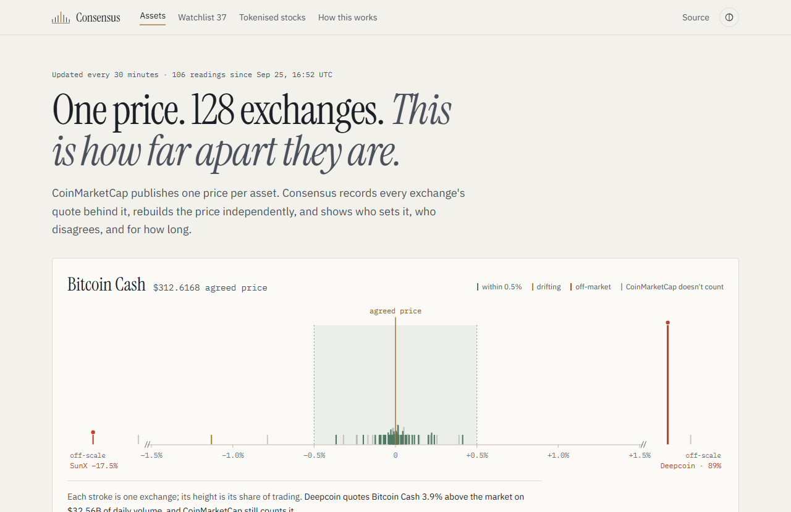

# Consensus

**CoinMarketCap publishes one price per asset. Consensus shows how that price is made across perpetual-futures venues, how concentrated it is, and where the venues disagree.**

Live: https://consensus-cmc.vercel.app · Track: **Data and Visualisation** · Built for [Build with CMC: API Hackathon](https://dorahacks.io/hackathon/coinmarketcap-api-202609/detail) · #BuildwithCMC



A recorder captures per-venue price, volume, open interest, funding and basis for 38 assets (about 3,700 venue rows per capture), plus liquidations and Uniswap v3 pools, on a fixed schedule. The site scores each asset and shows *who sets the price*. Started at 15 assets on the free CMC Basic tier (15k credits/month); widened to 38 after the CMC team upgraded the key to the Startup tier (450k credits/month) for the event window — two assets (PEPE, SHIB) are deliberately excluded because their perpetual contracts are quoted in two different denominations across exchanges, a unit mismatch this project's scoring doesn't yet detect for crypto (it already does for tokenised gold — see [/methodology](https://consensus-cmc.vercel.app/methodology)).

Event API access reverts to the Basic tier when submissions close (30 Sep), before judging (1-16 Oct) begins, so the live site's actual capture cadence will widen from 30 minutes to a few hours during judging — `lib/budget.ts` throttles automatically rather than exhausting the key. The home page always states the real, current cadence from recent capture gaps, not a fixed claim.

## At a glance

| | |
|---|---|
| **Live** | https://consensus-cmc.vercel.app |
| **For judges** | https://consensus-cmc.vercel.app/judge — a 90-second click path through the strongest evidence, live |
| **Repo** | https://github.com/ketutezraugm/consensus-cmc (MIT) |
| **Demo video** | _link added at submission_ |
| **Verify it yourself** | `node --no-warnings --env-file=.env.local scripts/report.mjs` — reproduces every finding below from the live recorded data, no CMC credits spent |
| **Tests** | 105, `node --no-warnings --test` (~6s, offline — nothing above depends on a live key) |
| **Raw API evidence** | [`scripts/out/`](scripts/out) — real, saved responses, not paraphrased |
| **API feedback** | 24 items from real calls: [`docs/api-feedback.md`](docs/api-feedback.md). Strongest: the `market_id` duplicate below; no unit field on tokenised assets (a 97% "disagreement" that's actually gold priced per gram vs per troy ounce); tier docs don't say which endpoints each plan actually gets |

**The headline finding:** CoinMarketCap's own API returns Kraken's BTC perpetual market twice, under the same `market_id` (47233), with two conflicting prices in the same response — and flags neither row. Consensus catches this because it checks every market for duplicates on every capture; CMC's own `exclusions` field never does, on this or 6 other duplicated markets in the latest capture alone. And it isn't just an alarm system: built only from venue-level data, with no knowledge of CMC's own published number, it independently reconstructs that number to within a median of **19 bps** across 37 assets — checked against ground truth, not just flagged as a risk.

## One repository, three entries

The same recorder and analysis engine power three differently-scoped submissions, disclosed here on purpose:

| Entry | Track | What it is | Doc |
|---|---|---|---|
| **Consensus** | Data and Visualisation | The web app: per-venue price dispersion, history, tokenised assets | this README |
| **Consensus Alerts** | Markets and Trading Tools | Pre-trade venue-risk bot (Telegram) and `/api/alerts` | [docs/submission-trading-alerts.md](docs/submission-trading-alerts.md) |
| **Consensus MCP** | AI Agents and Automation | Remote MCP server, five tools: `claude mcp add --transport http consensus https://consensus-cmc.vercel.app/api/mcp` | [docs/submission-mcp.md](docs/submission-mcp.md) |

## What it found

Recorded 2026-09-25 onward, 102 captures and counting. Reproduce every number below with `node --no-warnings --env-file=.env.local scripts/report.mjs` (fast — it's the exact code the home page runs). Ordered by how defensible the claim is, strongest first.

| Finding | Evidence |
|---|---|
| **We independently reconstructed CMC's own published price to within a median of 19 bps** across 37 assets — a volume-weighted composite built only from venue-level data, with no knowledge of CMC's published number, computed after the fact. Widest: BCH diverges by 531 bps. | Every capture |
| **The API returns some markets twice with conflicting prices, on a reputable venue.** Kraken's BTC perp (`market_id` 47233) appears as $82,737 and $66,959 in the same response; neither row is flagged. Same for Kraken ETH/XRP/LTC and DigiFinex ETH, plus MemeMax's XLM market since the watchlist widened — a data-return defect, not a thin-venue quirk. | 7 duplicated markets in the latest capture, present every capture since duplicates were kept |
| **BCH perp volume is one venue.** Deepcoin holds 90%+ of BCH's 24h perp volume. CMC excludes only a few percent of BCH's volume from its own aggregation. | 90%+ in 88 of 102 captures |
| **SunX quotes off-market on 29 of 38 tracked assets and is never flagged.** Typically 13% below the median. | 102 of 102 captures. Its volume is small, so it barely moves an aggregate |
| **CMC excludes a median 48% of perp volume** from its own aggregation (1%-80% by asset). | Every capture |
| **Tokenised assets mostly agree, with one large exception.** Median weighted disagreement between issuers of the same asset is 1.1 bps across 81 scored assets (98 tracked; 17 have no usable price data yet). SpaceX (SPCX) is the exception: two pre-IPO wrappers (Tessera, PreStocks) still price it multiples of the other 9 issuers. The API does not say why. | Latest capture; history accumulating |
| **Gold tokens priced per gram look like a 97% disagreement** unless units are handled. Consensus detects and excludes them. | Every capture |
| **DEX and exchange prices agree.** Liquidity-weighted Uniswap v3 prices are within 20 bps of the exchange reference for BTC (-10 bps), ETH (-2 bps), LINK (+19 bps). | A consistency result, not an anomaly |

What these do **not** show: whether CMC's headline price actually uses the flagged rows, or whether Deepcoin's volume is real. They are observations about what the API returns.

## How it works

```
Supabase pg_cron ──POST──> /api/ingest ──> CMC API ──> Supabase (observations, liquidations)
                                                                              │
                                   browser <── Next.js server components <────┘  scoring in lib/consensus.ts
```

- `lib/consensus.ts` is pure scoring code with no I/O. `test/consensus.test.mjs` covers it, including the degenerate cases (single venue, zero volume, zero open interest, negative funding, dead pools).
- **Confidence (0-100)** blends volume spread across venues (40%), share of volume within 50 bps of the median (30%), freshness (15%) and share of volume CMC excludes (15%). **The weights are a judgement call, not a fitted model.** Every asset page shows the four components broken out with their point contributions — a surprising ranking (e.g. one asset outscoring a less-concentrated one) is explained by the numbers right there, not hidden behind a single score. Full breakdown, including what's been checked against real data versus stated as a judgement call, is on [/methodology](https://consensus-cmc.vercel.app/methodology).
- Each asset page also checks the recorded venue composite against **CMC's own single published price** for that asset — never used as an input, only as an independent check.
- Price statistics use only venues CMC itself trusts for price (`exclusions` does not contain `price`).
- The on-chain layer covers BTC (via WBTC), ETH (via WETH) and LINK only. Wrapped tokens are not the underlying, so part of any gap can be wrapper risk.

## CMC endpoints used

| Endpoint | Used for | Credits |
|---|---|---|
| `GET /v5/cryptocurrency/derivatives/market-pairs/list/latest` (`crypto_id`, `category=perpetual`, `limit=250`) | Per-venue price, volume, open interest, index price, basis, funding, `outlier_detected`, `exclusions`. 38 calls per capture. | 1 per 250 pairs |
| `GET /v5/derivatives/liquidations/cryptocurrency/list/latest` | Long/short liquidations, 1h/4h/24h, per asset | 1 |
| `GET /v5/derivatives/liquidations/quotes/latest` | Market-wide liquidations | 1 |
| `GET /v4/dex/spot-pairs/latest` (`dex_slug=uniswap-v3`, `network_slug=ethereum`) | Pool price, liquidity, volume for WBTC/WETH/LINK vs stablecoins | 1 |
| `GET /v5/real-world-assets/assets/list` (`limit=100`) | The 100 highest-ranked tokenised assets | 1 |
| `GET /v5/real-world-assets/quotes/latest` (`rwa_id=` up to 100 ids in one call) | Every issuer's token for each asset: price, market cap, 24h volume | 1 |
| `GET /v1/cryptocurrency/quotes/latest` (`id=` 38 ids in one call) | CMC's own single published price per asset, checked against our composite — never fed into it | 1 |

About 44-46 credits per capture. Started on the free Basic tier (15k credits/month, ~21-23 credits/capture at 15 assets); the CMC team upgraded the key to the Startup tier (450k credits/month) on 2026-09-28 for the event window, which is what made widening to 38 assets and 100 tokenised assets possible at a 30-minute cadence. That access reverts to Basic at submission close, so the cadence widens automatically during judging — see the note above.

Also probed during development, not used by the product: `/v5/exchange/derivatives/list`, `/v5/real-world-assets/{map,issuers/list}` (200 on Basic), `/v5/real-world-assets/market-pairs/list` (403 on Basic), and `/v2/cryptocurrency/market-pairs/latest` and `/v1/exchange/listings/latest` (403 on Basic). Raw responses are in [`scripts/out/`](scripts/out).

## Evidence of real API calls

Code: [`scripts/probe.mjs`](scripts/probe.mjs) and [`app/api/ingest/route.ts`](app/api/ingest/route.ts). Responses: [`scripts/out/`](scripts/out). A trimmed real response from `derivatives/liquidations/quotes/latest`:

```json
{ "data": { "quotes": [ { "symbol": "USD", "total_liquidations_24h": 271450100.5357326,
    "long_liquidations_24h": 140387785.74551252, "short_liquidations_24h": 131062314.79022013,
    "last_updated": "2026-09-25T16:31:00.000Z" } ] },
  "status": { "timestamp": "2026-09-25T16:33:18.280Z", "error_code": "0", "credit_count": 1 } }
```

And the duplicate-market response (`scripts/out/deriv-pairs.json`, Kraken, same `market_id`, same `last_updated`):

```
market_id 47233  XBT/USD perpetual  price 84012.0   reported 84027   exclusions []
market_id 47233  XBT/USD perpetual  price 66959.0   reported 66922   exclusions []
```

## What the API made possible, and where it got in the way

Full list with 24 items in [`docs/api-feedback.md`](docs/api-feedback.md). The short version:

- **Made possible:** one call returns per-venue price, volume, open interest, index price, basis and funding, plus CMC's own `outlier_detected` and `exclusions`. Exposing the exclusions is what makes an analysis of *how the headline price is made* possible at all. Separately, the same API's single published-price endpoint let us check our own reconstruction against it — a validation loop the API supports without meaning to.
- **In the way:** the docs do not say which tier each endpoint needs (derivatives and RWA answered on Basic, spot market-pairs did not); `market_id` is not a unique key; the endpoint mixes base-side and quote-side pairs; `/v4/dex/networks/list` returned a 500; `limit=200` silently returns 100; RWA data has no underlying price, so tokenised-vs-underlying comparison is not possible yet.

## Run it

```bash
cp .env.example .env.local        # CMC_API_KEY, INGEST_SECRET, SUPABASE_URL, SUPABASE_SERVICE_KEY
# run every file in supabase/migrations/ (0001-0007, in order) in your Supabase SQL editor
npm install && npm run dev
node --no-warnings --test         # scoring tests
node --env-file=.env.local scripts/probe.mjs   # call every endpoint family once
curl -X POST -H "Authorization: Bearer $INGEST_SECRET" localhost:3000/api/ingest   # one capture (?dry=1 to skip the write)
```

Scheduling: Supabase `pg_cron` calls the ingest endpoint every 30 minutes ([`supabase/cron.example.sql`](supabase/cron.example.sql)); `lib/budget.ts` then skips a call when the key's remaining credit budget for the reset period requires it, which is what widens the effective cadence past 30 minutes on the Basic tier. `.github/workflows/ingest.yml` is a manual trigger only: GitHub throttled its cron to one run every 3-5 hours, too coarse for the history. Keys live only in environment variables and are never committed.
